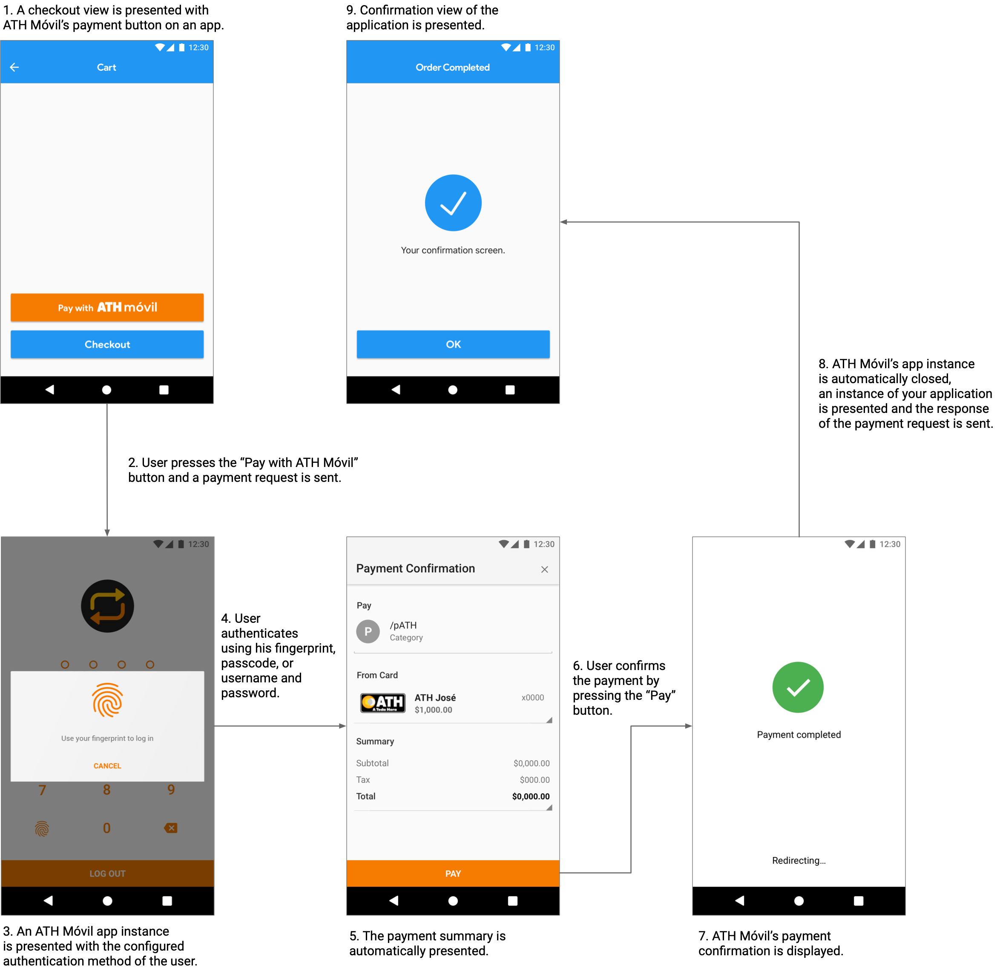

# ATH Móvil Android SDK

A simple, secure, and fast way to integrate ATH Móvil payments into your Android application.

## Introduction

The ATH Móvil SDK provides a simple checkout experience for customers paying in your Android application. By integrating our Payment Button, you can receive instant payments from more than a million ATH Móvil users.

## ⚠️ Important Notes

> **Testing Methods**
> While there is no dedicated testing *environment*, you can test your integration using the production ATH Móvil application. This can be done by simulating a transaction or by conducting a live transaction. See the [Testing](#testing) section for more details.

> **Platform Incompatibility**
> The ATH Móvil Payment Button is **not** compatible with any major Ecommerce platform. This includes Shopify, Wix, WooCommerce, or Stripe.

## Prerequisites

Before you begin, you must have:

### 1. ATH Business Account

*   An active ATH Business account.
*   A card registered in your ATH Business profile.
*   Your public and private keys.
*   **To open an account:** [ATH Business Flyer (PDF)](https://github.com/user-attachments/files/16267504/ATHB.flyer.eng.letter.1.pdf)
*   **For more info:** [ATH Business Presentation (PPTX)](https://github.com/user-attachments/files/16267585/ATH.BUSINESS_Apr2024.pptx)

### 2. ATH Móvil (Personal) Account

To complete payments for testing, you must have:

*   An active ATH Móvil account.
*   A card registered in your ATH Móvil profile. **This cannot be the same card registered in your ATH Business account.**
*   **For more info:** [ATH Móvil Presentation (PPTX)](https://github.com/user-attachments/files/16267592/ATH.Movil_Apr2024.pptx)

## Installation

1.  Add the JitPack repository to your root `build.gradle` file:

    ```groovy
    allprojects {
        repositories {
            ...
            google()
            maven { url 'https://jitpack.io' }
        }
    }
    ```

2.  Add the SDK and GSON library dependencies to your app-level `build.gradle` file:

    ```groovy
    dependencies {
        …
        implementation 'com.github.evertec:athmovil-android-sdk:4.1.0'
        implementation 'com.google.code.gson:gson:2.13.2'
    }
    ```

## Integration Guide

Follow these steps to integrate the ATH Móvil Payment Button.

### Step 1: Add the Payment Button (XML)

Add the `PayButton` to your checkout view's XML layout file.

```xml
<com.evertecinc.athmovil.sdk.checkout.PayButton
    android:id="@+id/athm_pay_button"
    android:onClick="onClickPayButton"
    android:layout_width="match_parent"
    android:layout_height="60dp"
    app:theme="light"
    app:lang="en"
    />
```

#### Button Theme (`app:theme`)

| Style | Preview |
| :--- | :--- |
| `default` |  |
| `light` |  |
| `dark` |  |

#### Button Language (`app:lang`)

| Language | Preview |
| :--- | :--- |
| `default` | Uses the device's current language. |
| `en` |  |
| `es` |  |

-----

### Step 2: Configure AndroidManifest.xml

You need to update your `AndroidManifest.xml` to allow the app to open ATH Móvil and to handle the payment response callback.

#### Package Visibility (Android 11+)

To allow your app to open the ATH Móvil app on Android 11 (API 30) or higher, add the following `<queries>` element to your manifest:

```xml
<queries>
    <package android:name="com.evertec.athmovil.android" />
</queries>
```

#### Configure Callback Activity

Add an `<intent-filter>` to the Activity that will receive the payment response. The `android:name` in the `<action>` tag must match the `callbackSchema` you set in the payment request.

```xml
<activity android:name=".YourResponseActivity">
    <intent-filter>
        <action android:name="appbundle.schema" />
        <category android:name="android.intent.category.DEFAULT" />
    </intent-filter>
</activity>
```

-----

### Step 3: Configure and Send the Payment Request (Java)

In your checkout Activity, configure the payment details when the user clicks the payment button.

```java
import com.evertecinc.athmovil.sdk.checkout.OpenATHM;
import com.evertecinc.athmovil.sdk.checkout.objects.ATHMPayment;

public void onClickPayButton(View view) {
    // Create a new payment object with the current activity's context
    ATHMPayment payment = new ATHMPayment(this);

    // REQUIRED: Set the callback schema that will handle the response from ATH Móvil.
    // This MUST match the <action android:name> in your AndroidManifest.xml's intent-filter.
    payment.setCallbackSchema("appbundle.schema");

    // REQUIRED: Set your ATH Business public token.
    payment.setPublicToken("fb1f7ae2849a07da1545a89d997d8a435a5f21ac");

    // REQUIRED: Set the total amount for the transaction.
    payment.setTotal(1.00);

    // OPTIONAL: Set the subtotal. Defaults to 0.00 if not set.
    payment.setSubtotal(1.00);

    // OPTIONAL: Set the tax amount. Defaults to 0.00 if not set.
    payment.setTax(0.00);

    // OPTIONAL: Set the payment timeout in seconds. Defaults to 600 (10 minutes).
    payment.setTimeout(600);

    // OPTIONAL: Add custom metadata fields.
    payment.setMetadata1("metadata1 test");
    payment.setMetadata2("metadata2 test");

    // REQUIRED: For production, this must be an empty string.
    payment.setBuildType(""); 

    try {
        // Validate the payment data and start the checkout process
        OpenATHM.validateData(payment, this);
    } catch (Exception e) {
        // Handle any exceptions that occur during validation (e.g., missing required fields)
        // e.g., show an error message to the user
    }
}
```

#### `ATHMPayment` Configuration

| Method | Required | Description |
| :--- | :--- | :--- |
| `setPublicToken()` | Yes | Your ATH Business public token. |
| `setTotal()` | Yes | Total amount to be paid. |
| `setCallbackSchema()` | Yes | Unique URL scheme to handle the response. |
| `setBuildType()` | Yes | Set to `""` for production. |
| `setTimeout()` | No | Time in seconds before the payment expires (default is 600). |
| `setSubtotal()` | No | The subtotal of the payment. |
| `setTax()` | No | The tax amount of the payment. |
| `setMetadata1()` | No | Optional metadata. |
| `setMetadata2()` | No | Optional metadata. |
| `setItems()` | No | An array of `Items` objects. |
| `setPhoneNumber()` | No | Pre-fills the customer's phone number. |

-----

### Step 4: Handle the Payment Response (Java)

In the Activity you designated in your `AndroidManifest.xml`, implement `PaymentResponseListener` to handle the callback.

```java
import com.evertecinc.athmovil.sdk.checkout.PaymentResponse;
import com.evertecinc.athmovil.sdk.checkout.interfaces.PaymentResponseListener;
import com.evertecinc.athmovil.sdk.checkout.objects.Items;
import java.util.ArrayList;
import java.util.Date;

public class YourResponseActivity extends AppCompatActivity implements PaymentResponseListener {

    @Override
    protected void onCreate(Bundle savedInstanceState) {
        super.onCreate(savedInstanceState);
        PaymentResponse.validatePaymentResponse(getIntent(), this);
    }

    @Override
    public void onCompletedPayment(Date date, String referenceNumber, String dailyTransactionID, String name, String phoneNumber, String email, Double total, Double tax, Double subtotal, String metadata1, String metadata2, ArrayList<Items> items) {
        // Payment was COMPLETED
    }

    @Override
    public void onCancelledPayment(Date date, String referenceNumber, String dailyTransactionID, String name, String phoneNumber, String email, Double total, Double tax, Double subtotal, String metadata1, String metadata2, ArrayList<Items> items) {
        // Payment was CANCELLED by the user
    }

    @Override
    public void onExpiredPayment(Date date, String referenceNumber, String dailyTransactionID, String name, String phoneNumber, String email, Double total, Double tax, Double subtotal, String metadata1, String metadata2, ArrayList<Items> items) {
        // Payment EXPIRED
    }

    @Override
    public void onFailedPayment(Date date, String referenceNumber, String dailyTransactionID, String name, String phoneNumber, String email, Double total, Double tax, Double subtotal, String metadata1, String metadata2, ArrayList<Items> items) {
        // Payment FAILED
    }

    @Override
    public void onPaymentException(String error, String description) {
        // An exception or error occurred
    }
}
```

#### Response Variables

| Variable | Description |
| :--- | :--- |
| `dailyTransactionID` | Transaction consecutive. `0` if cancelled or expired. |
| `referenceNumber` | Unique transaction identifier. Empty string if cancelled or expired. |
| `date` | Transaction's date. |
| `name` | ATH Móvil customer's name. |
| `phoneNumber` | ATH Móvil customer's phone number. |
| `email` | ATH Móvil customer's email. |

## Testing

You can test your integration using the ATH Móvil Personal Application. There are two ways to test:

*   **Live Transaction:** Use your real `publicToken` to send a live payment. This will generate a real transaction and move money.

*   **Simulated Transaction:** Set the `publicToken` to `"dummy"`. The ATH Móvil app will simulate the payment flow, allowing you to test completed, expired, or cancelled responses without moving any money.

```java
// To simulate a transaction
payment.setPublicToken("dummy"); 
```

## Support

*   **General Questions:** Visit [athmovilbusiness.com/preguntas](https://athmovilbusiness.com/preguntas) or call (787) 773-5466.
*   **Technical Support:** Complete this [form](https://forms.gle/ZSeL8DtxVNP2K2iDA).

## User Experience



## Legal

The use of this API and any related documentation is governed by and must be used in accordance with the Terms and Conditions of Use of ATH Móvil Business®, which may be found at: [https://athmovilbusiness.com/terminos](https://athmovilbusiness.com/terminos).
